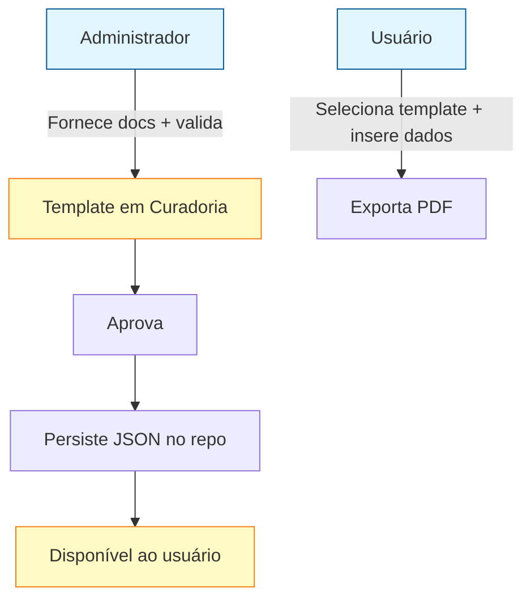

# PRD — Currículo otimizado por vaga

> O quê e por quê. Requisitos de negócio deste projeto.

## 1. Problema

Gerenciar as informações do meu currículo e exportá-lo de forma otimizada para vagas específicas, com formatação decente em PDF.

A origem da especificação detalhada está na conversa com o Gemini, disponível em [`referencia/dump_gemini.txt`](referencia/dump_gemini.txt).

## 2. Objetivo

A partir de uma **fonte única de dados estruturados** e de **templates curados manualmente**, gerar PDFs de currículo com fidelidade visual ao template escolhido, de forma automatizada e sem quebrar o layout quando o conteúdo é maior que o do modelo.

## 3. Requisitos funcionais

### 3.0 Personas

> Nota: em contexto pessoal, as duas personas podem ser a mesma pessoa em momentos diferentes.

### 3.1 Fonte de dados
- **RF-1** Manter os dados do currículo em um formato estruturado único (ex.: JSON/YAML), editável manualmente.
- **RF-2** O schema cobre: nome, cargo/objetivo, contato, competências, experiências (empresa, período, cargo, descrição), formação, idiomas e projetos. Definido em [`schema.md`](schema.md) — modelo conceitual agnóstico de armazenamento, com exportação JSON/YAML.

### 3.2 Templates
- **RF-3** O **administrador** fornece os documentos (PDF/DOCX) que se tornarão templates; o usuário escolhe entre os templates já disponibilizados e testados.
- **RF-4** Cada template possui uma **representação intermediária** (`TemplateConfig`: pageSize, margens, largura de colunas, cores, estilos).
- **RF-5** O sistema suporta múltiplos templates (ex.: duas colunas, minimalista), selecionáveis na geração.
- **RF-6** **Ciclo de vida do template**: fornecido → representado → testado → **aprovado** → persistido. Somente templates aprovados ficam disponíveis ao usuário.
- **RF-7** Templates **aprovados são persistidos em JSON** e adicionados ao repositório do projeto (fonte versionável, revisável e reproduzível).

### 3.3 Pipeline de geração
- **RF-8** Fluxo: dados validados → motor de injeção → renderizador → PDF final.
- **RF-9** Camada de validação/sanitização: padroniza formatos, limpa quebras de linha fantasmas, aplica limites de segurança em campos críticos (ex.: sidebar).
- **RF-10** **Fidelidade visual**: o PDF gerado deve se parecer com o template escolhido (fontes, espaçamentos, margens, cores).
- **RF-11** **Layout expansível**: o documento pode se expandir para múltiplas páginas sem quebrar a diagramação.
- **RF-12** **Sem quebras feias**: blocos de experiência não podem ser cortados ao meio entre páginas (comportamento equivalente a `unbreakable`).

### 3.4 Agente de IA (extensão futura)
- **RF-13** Interface **agnóstica de provedor** para um agente de IA que estrutura/rotula dados não estruturados (ex.: ler um currículo antigo e preencher o schema).
- **RF-14** Não bloqueia a versão 1: com fonte manual, o agente é opcional e plugável depois.

### 3.5 Tipos de currículo e verificação automática
- **RF-15** O sistema define os tipos de currículo suportados (`vitae` e `lattes`), com as seções/campos exigidos, campos proibidos e regras de formato de cada um (ver [schema.md §3](schema.md#3-tipos-de-currículo-e-verificação-automática)).
- **RF-16** Função de **verificação automática**: o usuário recebe um relatório informando se seu currículo se enquadra no tipo escolhido e o que falta/está mal formatado.
- **RF-17** **Exportação multi-versão**: a partir da mesma fonte, exportar versões diferentes do currículo (ex.: versão vitae e versão lattes), desde que as informações sejam suficientes para o tipo.

### 3.6 Privacidade e LGPD
- **RF-18** Dados sensíveis (CPF, passaporte, nascimento, filiação) são de **fornecimento opcional**.
- **RF-19** O armazenamento desses dados observa a **LGPD** (base legal, minimização, criptografia, direitos do titular, retenção) — ver [schema.md §6](schema.md#6-lgpd-e-dados-sensíveis).

## 4. Fora do escopo (v1)

- **Otimização automática por vaga** (IA lê a descrição da vaga e reescreve/filtra o conteúdo) — decisão adiada para iteração futura.
- Parser automático de PDFs de exemplo para criar representações intermediárias.
- Edição visual WYSIWYG do layout.

## 5. Critérios de aceitação

- **CA-1** Dado um conjunto de dados estruturados e um template escolhido, gera-se um PDF em um comando.
- **CA-2** O PDF resultante reproduz a diagramação do template (colunas, cores, seções).
- **CA-3** Com um histórico longo (várias experiências), o PDF expande para mais de uma página sem sobrepor ou cortar blocos.
- **CA-4** A validação impede textos longos de estourar a largura da sidebar.
- **CA-5** A seção de arquitetura do SDD não acopla a solução a nenhuma biblioteca/provedor específico.
- **CA-6** A verificação por tipo (`vitae`/`lattes`) aponta corretamente itens ausentes, mal formatados e proibidos, e bloqueia a exportação quando os dados são insuficientes.
- **CA-7** As mesmas fontes de dados geram versões `vitae` e `lattes` distintas (multi-versão), respeitando os requisitos de cada tipo.
- **CA-8** Dados `privado` (ex.: CPF) nunca aparecem em nenhum PDF de exibição; o armazenamento segue os controles da LGPD (criptografia, acesso, exclusão).
- **CA-9** Somente templates aprovados pelo administrador ficam disponíveis ao usuário.
- **CA-10** Templates aprovados são persistidos em **JSON no repositório do projeto** e o pipeline os consome a partir desse arquivo.

## 6. Métricas de sucesso

- Tempo para gerar um currículo novo: < 1 min.
- Zero ajuste manual no PDF gerado.
- Adoção: usado como pipeline padrão para minhas candidaturas.