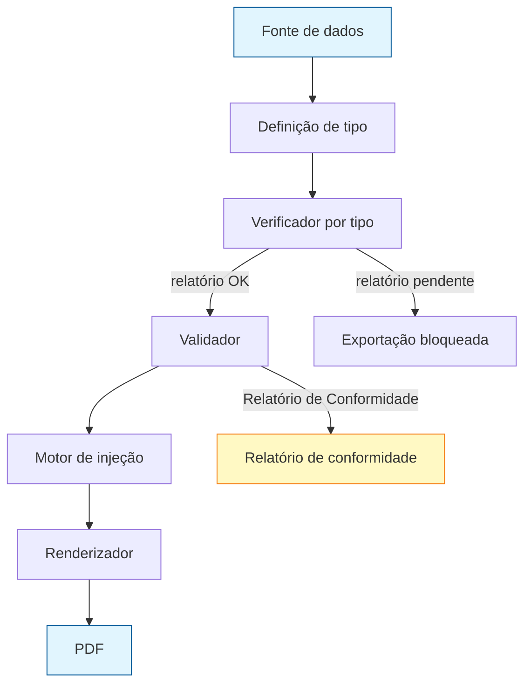

# SDD — Currículo otimizado por vaga

> Como implementar. As decisões estão divididas em duas seções, **nesta ordem**:
> 1. **Arquitetura** — agnóstica de tecnologia.
> 2. **Tecnologias candidatas** — provisórias; espera-se testar abordagens/bibliotecas diferentes antes de fixar.

---

## Seção 1 — Arquitetura (independente de tecnologia)

### 1.1 Visão geral

Pipeline de dados → PDF, com as responsabilidades isoladas em camadas com contratos bem definidos.



### 1.2 Camadas

| Camada | Responsabilidade | Entrada | Saída |

### 1.2 Camadas

| Camada | Responsabilidade | Entrada | Saída |
|---|---|---|---|
| **Fonte de dados** | Armazenar os dados do candidato em formato estruturado | edição manual | `ResumeData` (schema) |
| **Definição de tipo** | Declarar exigências por tipo de currículo (obrigatórios, proibidos, formatos) | curadoria manual | `TipoCurriculo` |
| **Verificador por tipo** | Comparar `ResumeData` com `TipoCurriculo` e emitir relatório; funciona como gate da exportação | `ResumeData` + `TipoCurriculo` | `RelatorioConformidade` |
| **Schema do template** | Descrever o layout do template de forma declarativa (pageSize, margens, colunas, cores, estilos) — persistido como **JSON no repositório do projeto**; consumido pelo motor de injeção | curadoria do administrador | `TemplateConfig` (JSON versionável) |
| **Validador/Sanitizador** | Padronizar formatos, limpar texto, aplicar limites de segurança em campos críticos | `ResumeData` | `ResumeData` limpo |
| **Motor de injeção** | Cruzar dados validados com o `TemplateConfig` e produzir a definição de documento para o renderizador | `ResumeData` + `TemplateConfig` | `DocDefinition` (agnóstico) |
| **Renderizador** | Transformar a `DocDefinition` no PDF final (interface abstrata; implementações podem variar) | `DocDefinition` | PDF |
| **Adaptador de IA** *(opcional)* | Estruturar dados não estruturados (ex.: currículo antigo) no schema, via interface **independente de provedor** | texto bruto | `ResumeData` |

### 1.3 Contratos-chave (conceituais)

- **`ResumeData`** — schema único de dados do candidato. Definido em [`schema.md`](schema.md) (modelo conceitual agnóstico de armazenamento; JSON/YAML derivados do mesmo modelo).
- **`TipoCurriculo`** — declaração de exigências de um tipo (`vitae`, `lattes`): módulos/campos obrigatórios, campos proibidos e regras de formato. Base da verificação e da exportação multi-versão (ver [`schema.md §3`](schema.md#3-tipos-de-currículo-e-verificação-automática)).
- **`RelatorioConformidade`** — resultado da verificação: itens presentes/ausentes/mal formatados/proibidos, com referência a `module.campo` e à regra violada.
- **`TemplateConfig`** — configuração declarativa do layout:
  - `pageSize`, `pageMargins`
  - largura das colunas (sidebar fixa + corpo flexível)
  - cores, fontes, espaçamentos, marcadores de seção
  - regras de fluxo (blocos que não devem ser quebrados entre páginas)
  - **persistência**: arquivos **JSON versionados no repositório do projeto** (ver [Seção 1.6](#16-personas-e-ciclo-de-vida-do-template))
- **`DocDefinition`** — documento renderizável, ainda agnóstico de engine (o `TemplateConfig` já é uma boa aproximação; a conversão para o formato nativo do renderizador acontece na implementação).
- **Interface do renderizador** — recebe `DocDefinition` e devolve um PDF (bytes/arquivo).

### 1.4 Regras de design

- **Sem posições absolutas**: layout construído com fluxo (empilhar/colunas) e não com coordenadas X/Y, para o conteúdo crescer sem quebrar.
- **Blocos atômicos**: cada experiência é um bloco que não pode ser cortado entre páginas; se não couber, migra inteiro para a próxima página.
- **Multi-página**: o documento pode exceder uma página; a paginação é calculada pelo engine de renderização.
- **Fidelidade**: a fidelidade visual vem do mapeamento fiel do template na `TemplateConfig` (não de tentar reconstruir layout via OCR/parsing).
- **Desacoplamento do provedor de IA**: o adaptador de IA define apenas o contrato (entrada → `ResumeData`); provedores concretos são implementações plugáveis.
- **Verificação como gate**: a exportação só prossegue se o `RelatorioConformidade` do tipo escolhido não tiver pendências bloqueantes; caso contrário, devolve o relatório.
- **Dados `privado` fora do pipeline de exibição**: campos `privado` (CPF, nascimento, filiação) são usados apenas pelo tipo `lattes`/registro e jamais chegam ao renderizador de CVs; o armazenamento segue os controles de [LGPD no schema.md §6](schema.md#6-lgpd-e-dados-sensíveis) (criptografia, consentimento, acesso/exclusão).
- **Decisões de biblioteca são provisórias**: nada na arquitetura depende de uma lib específica (ver Seção 2).

### 1.5 Personas e papéis

| Persona | Papel na arquitetura |
|---|---|
| **Administrador** | Curadoria de templates: fornece o documento (PDF/DOCX) de origem, valida a `TemplateConfig`, testa a geração e **aprova**; só então o template entra no catálogo |
| **Usuário** | Insere dados via formulários (futuro: upload de PDF), escolhe um template aprovado e dispara a exportação |

> Em contexto pessoal, uma mesma pessoa exerce os dois papéis em momentos distintos (hora de curar templates, hora de gerar currículos).

### 1.6 Ciclo de vida do template

```mermaid
flowchart TD
    A[Fornecido] --> B[Representado (TemplateConfig)]
    B --> C[Testado]
    C --> D[Aprovado]
    D --> E[Persistido (JSON no repo)]
    E --> F[Disponível ao usuário]
    style A fill:#e1f5fe,stroke:#015797
    style F fill:#e1f5fe,stroke:#015797
    style B fill:#fff9c4,stroke:#f57f17
    style C fill:#fff9c4,stroke:#f57f17
    style D fill:#fff9c4,stroke:#f57f17
```

---

## Seção 2 — Tecnologias candidatas (provisórias, a testar)

> Esta seção registra os experimentos em andamento. Decisões fixadas virão dos testes; mudanças de lib **não** devem impactar a Seção 1.

### 2.1 Renderizadores (gera o PDF a partir da `DocDefinition`)

| Candidato | Linguagem | Prós | Contras | Status |
|---|---|---|---|---|
| **pdfmake** | JS | Nativo em JS; `columns`/`stack`/`unbreakable` mapeiam direto a arquitetura; roda front e back | Fontes e controle fino limitados | a testar |
| **WeasyPrint / reportlab** | Python | Layout CSS rico / controle total | Curva de aprendizado; longe do modelo `columns` do pdfmake | a testar |
| **HTML → PDF** (Puppeteer/LaTeX) | JS/TeX | Liberdade total de CSS | Mais pesado, mais frágil | a testar |

### 2.2 Templates/representação intermediária

- Definição declarativa em **JSON/YAML** (formato neutro, independente do renderizador).

### 2.3 Validação/sanitização e verificação por tipo

- Validação/sanitização: lógica própria (funções puras) — sem dependência externa necessária nesta fase.
- Verificação por tipo: consome a declaração `TipoCurriculo` (definida como dado/config, não código) — viabiliza novos tipos sem alterar o motor.

### 2.4 Adaptador de IA (agnóstico)

- Contrato de "structured output" via **APIs compatíveis com OpenAI** (ex.: DeepSeek, OpenAI, Gemini) para permitir troca de provedor.
- Não bloqueia v1 (fonte manual). Será implementado quando a otimização por vaga / parse automático entrarem em escopo.

### 2.5 Ambiente de teste

- Testes das abordagens provavelmente via **agente de codificação** (ex.: opencode, pi) com acesso limitado/gratuito a modelos.

## 3. Decisões em aberto

- Linguagem base do backend (JS vs Python) — dependente dos resultados da Seção 2.
- Estrutura do schema de dados (YAML vs JSON).
- ~~Formato de armazenamento dos templates~~ → **definido**: templates aprovados persistidos como **JSON no repositório do projeto** (ver Seção 1.6).
- Armazenamento/criptografia de dados `privado` (LGPD) — quando o banco for definido.
- Quantos templates oficiais na v1 (mínimo sugerido: 1 de duas colunas).